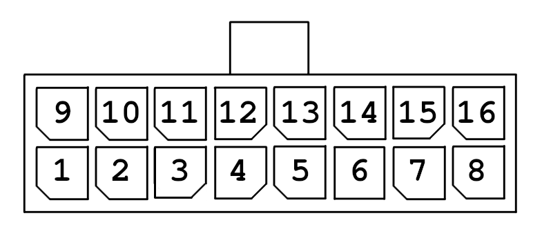

# Pinout - 16 Pin Harness and 10 Pin Harness

All TR boards (& derivatives) are using a non-standard 16 pin pinout that does not match the carabiner pinout due to alternative power and signaling requirements.

We welcome other groups using the cable for their projects, but kindly ask to note in their project page if they are using the official TR 16 pin pinout, to help prevent damage to users equipment, caused by different pinouts.

## Pinout - 16 Pin Harness

This pinout assumes you're looking directly at the cable. 

| PinNumber | Usage  | OnPCB | PinNumber | Usage | OnPCB | 
|-------------|:------------------:|:------------------:| ------------- |:------------------:|:------------------:|
| 1  | 5V Input | 5V | 9 | Aux Pin 3 | Aux3
| 2  | Aux Pin 4 | Aux4 | 10 | Aux Pin 2 | Aux2
| 3  | Common Ground | CMN_GND | 11 | Aux Pin 1 | Aux1
| 4  | Feeder End Stop Signal | F_ESTOP_SIGNAL | 12 | Selector End Stop Signal | S_ESTOP_SIGNAL
| 5  | Motor 1 1A | Stepper1A_1 | 13 | Motor 1 2B | Stepper2B_1
| 6  | Motor 1 1B | Stepper1B_1 | 14 | Motor 1 2A | Stepper2A_1
| 7  | Motor 2 1A | Stepper1A_2 | 15 | Motor 2 2B | Stepper2B_2
| 8  | Motor 2 1B | Stepper1B_2 | 16 | Motor 2 2A | Stepper2A_2

## Pinout - 10 Pin Harness

This pinout assumes you're looking directly at the cable. 

| PinNumber | Usage  | OnPCB | PinNumber | Usage | OnPCB | 
|-------------|:------------------:|:------------------:| ------------- |:------------------:|:------------------:|
| 1  | Motor 1 1A | Stepper1A_1 | 6 | Common Ground | CMN_GND 
| 2  | Motor 1 1B | Stepper1B_1 | 7 | 5V Input | 5V
| 3  | Motor 1 2B | Stepper2B_1 | 8 | Aux Pin 3 | Aux3
| 4  | Motor 1 2A | Stepper2A_1 | 9 | Aux Pin 2 | Aux2
| 5  | Feeder End Stop Signal | F_ESTOP_SIGNAL | 10 | Aux Pin 1 | Aux1

## Recommended Wiregauge - 16 Pin Harness

While we have official cables available, we don't want to discourage people making their own cables, as such here is our recommended minimum wiregauge, for making a cable with the official pinout.
These recommendations assume the TR boards are being used in a 50° chamber.

| Pin-Number | Recommended AWG | Recommended mm² |
|:-----------:|:---------------:|:---------------:|
| 1 | 22 | 0.3 |
| 2 | 26 | 0.125 |
| 3 | 22 | 0.3 |
| 4 | 26 | 0.125 |
| 5 | 22 | 0.3 |
| 6 | 22 | 0.3 |
| 7 | 22 | 0.3 |
| 8 | 22 | 0.3 |
| 9 | 26 | 0.125 |
| 10 | 26 | 0.125 |
| 11 | 26 | 0.125 |
| 12 | 26 | 0.125 |
| 13 | 22 | 0.3 |
| 14 | 22 | 0.3 |
| 15 | 22 | 0.3 |
| 16 | 22 | 0.3 |

## Recommended Wiregauge - 10 Pin Harness

While we have official cables available, we don't want to discourage people making their own cables, as such here is our recommended minimum wiregauge, for making a cable with the official pinout.
These recommendations assume the TR boards are being used in a 50° chamber.

| Pin-Number | Recommended AWG | Recommended mm² |
|:-----------:|:---------------:|:---------------:|
| 1 | 22 | 0.3 |
| 2 | 22 | 0.3 |
| 3 | 22 | 0.3 |
| 4 | 22 | 0.3 |
| 5 | 26 | 0.125 |
| 6 | 22 | 0.3 |
| 7 | 22 | 0.3 |
| 8 | 26 | 0.125 |
| 9 | 26 | 0.125 |
| 10 | 26 | 0.125 |

## License

The pinout is licensed under the [MIT license] (https://github.com/git/git-scm.com/blob/main/MIT-LICENSE.txt)
