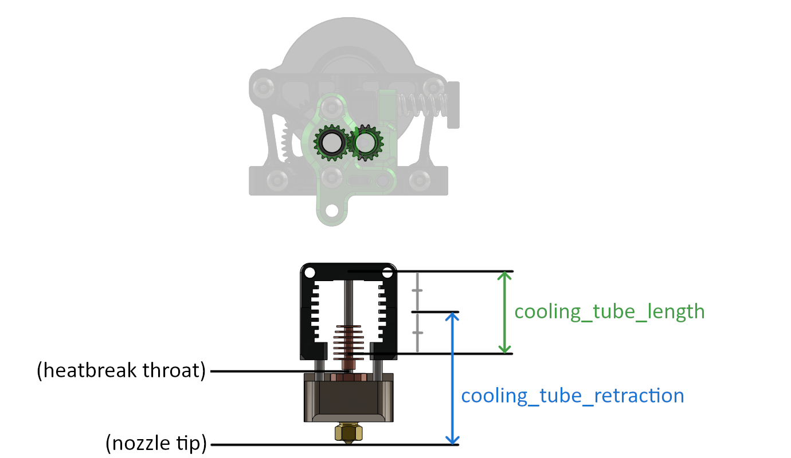

# Slicing

This document explains how to get your slicer set up for multimaterial
printing with Trad Rack. These instructions are mainly geared towards
PrusaSlicer and SuperSlicer, but some parts may be relevant to other slicers
(such as OrcaSlicer) that are based on Slic3r and PrusaSlicer.

**Table of Contents**
- [Provided slicer profiles](#provided-slicer-profiles)
  - [Prerequisites](#prerequisites)
  - [Setup](#setup)
  - [Experimental options](#experimental-options)
- [Changes to make to existing profiles](#changes-to-make-to-existing-profiles)
  - [Printer settings](#printer-settings)
    - [Common settings](#common-settings)
    - [Toolhead-specific settings](#toolhead-specific-settings)
  - [Print settings](#print-settings)
  - [Filament settings](#filament-settings)

## Provided slicer profiles

Example slicer profiles are provided for PrusaSlicer and SuperSlicer.
These profiles are meant for use with a K3 running a Sherpa Micro
extruder and Mosquito Magnum hotend, but they can be modified to fit
other setups.

### Prerequisites

These profiles assume you have included
[trad_rack_optional.cfg](/Klipper_Stuff/klipper_config/trad_rack_optional.cfg)
in your Klipper config and that you have a `Print_Start` g-code macro
that takes the following parameters:

- `EXTRUDER`: Hotend temperature
- `BED`: Bed temperature

### Setup

See the [PrusaSlicer_Setup](PrusaSlicer_Setup.md) or 
[SuperSlicer_Setup document](SuperSlicer_Setup.md) for information on
adding the provided profiles to your slicer, as well as any setup tips
that pertain to that slicer specifically. In addition, if you are
using a different printer or toolhead setup, you may need to change
values in the "Single extruder multimaterial parameters" and
"Toolchange parameters with single extruder MM printers" sections in
the slicer. See
[toolhead-specific settings](#toolhead-specific-settings) and
[filament settings](#filament-settings) for more details on these
settings.

### Experimental options

Experimental profiles are included that eliminate the ramming and/or
unload gcode generated by the slicer in favor of using gcode or macros
called by the toolchange command: print profiles with "No Unload" and
filament profiles with "No Ramming" in their name. You must
select a printer profile with "Experimental" in its name to allow
these print and/or filament profiles to be selected.

In addition, if you use a "No Unload" print profile, you must modify
`post_process` depending on where you have Python installed and where
[remove_unload.py](/Slicer_Scripts/remove_unload.py) is located on
your computer. You can do this either in the slicer or by directly
editing the `Annex_K3_TR.ini` file in a text editor. If you choose to
edit `Annex_K3_TR.ini`, keep in mind that special characters such as
`"` and `\` must be escaped with a backslash. For example, here is the
setting I use, shown in the slicer:


And in the .ini file:

```ini
[print:*No Unload*]
post_process = "\"C:\\Users\\Ryan\\AppData\\Local\\Programs\\Python\\Python310\\python.exe\" \"C:\\Users\\Ryan\\Documents\\3d printing stuff\\TradRack_Beta\\Slicer_Scripts\\remove_unload.py\""
```

If you don't know where you have Python installed, you can use the
following command in the terminal to get the path:

```shell
python -c "import sys; print(sys.executable)"
```

If the above command doesn't work, try using `python3` instead of
`python`.

The script requires the following slicer settings in your filament
profile(s) to work:
- set `filament_unloading_speed_start` to `100`
- make sure your `end_filament_gcode` starts with the comment
  `; Filament-specific end gcode`

With the ramming and/or unload gcode removed, you will need to have
some sort of replacement run in the `pre_unload_gcode` in the
[trad_rack] section of your Klipper config. The simplest way to do
this (assuming you have included
[trad_rack_optional.cfg](/Klipper_Stuff/klipper_config/trad_rack_optional.cfg))
is to set `variable_shape_tip` to `True` in the
[gcode_macro TR_Variables] section. Keep in mind that the provided
`Shape_Tip` macro includes both ramming and unloading.

## Changes to make to existing profiles

This section explains changes to make to an existing single-tool
slicer profile. Setting names used here follow the "parameter names"
that are used in the slicer config files; you can use the search
function to see which settings these correspond to in the GUI.

### Printer settings

The following changes should be made to the printer config file in the
Printer Settings tab:

#### Common settings

- `extruders_count`: Set this to the number of lanes.
- `single_extruder_multi_material`: Set to `true` (`1` in the config).
- `start_gcode`:
  - Add the following lines to the beginning of the Start G-code
    section:
    
    ```
    CLEAR_PAUSE
    TR_LOCATE_SELECTOR
    T{initial_tool} MIN_TEMP={first_layer_temperature[initial_tool]}
    ```
    
    Explanation:
    - `CLEAR_PAUSE`: Clears the paused state.
    - `TR_LOCATE_SELECTOR`: See the
      [G-Codes document](/docs/klipper/G-Codes.md/#tr_locate_selector)
      for more details.
    - `T{initial_tool} MIN_TEMP={...}`: Loads the first filament into
      the toolhead.
  - Usually not required: if any g-code command or macro that gets
    called within your Start G-code section contains the `M18` or
    `M84` command, add the following to the end of
    the Start G-code section:
    
    ```
    TR_SET_ACTIVE_LANE LANE={initial_tool}
    ```

    > [!NOTE]
    > This includes commands that are called indirectly. For example,
    > if the Start G-code section contains `Print_Start` and your
    > `Print_Start` macro calls `G28`, and your config includes a
    > \[homing_override\] section that causes `G28` to call `M18` or
    > `M84`, this would still count.

    Explanation:
    - The `M18` or `M84` command disables all motors on the printer,
      including Trad Rack's motors. This will cause problems the next
      time Trad Rack tries to move its selector. Normally it is a bad
      idea to disable the motors inside your start g-code. However,
      it is sometimes used as a workaround in the \[homing_override\]
      section in order to allow the printer to move an axis without
      marking that axis as homed. For example, you may want to lift
      the z axis before homing x and y to ensure the nozzle does not
      scrape on the bed. If you do not want to remove `M18` or `M84`
      from the command or macro that is being called in your Start
      G-code section, the `TR_SET_ACTIVE_LANE` command can be used as
      shown above to force Trad Rack to set the selector's position
      without homing it again.
- `retract_length_toolchange`: Set to `0` for all extruders.

#### Toolhead-specific settings

- `cooling_tube_retraction`: Distance between the nozzle tip and the
  center of the "cooling tube." The cooling tube should start somewhere
  above the heatbreak throat and end somewhere below the extruder
  gears. I recommend having the top end below the top of the heatsink,
  but it can extend further if you wish (more experimentation needed).
  Note that the slicer recommends using the extruder/nozzle tip as the
  starting point, but the filament tip will likely break away from the
  molten filament above that point when unloading.
- `cooling_tube_length`: See the above explanation for
  `cooling_tube_retraction`.

  See the drawing below for a visualization of the cooling tube settings.
  Colorful labels are slicer settings, and black labels in
  parentheses are references that are used to determine the starting
  or ending points of the slicer settings.

  

- `parking_pos_retraction`: Set this to 
  `cooling_tube_retraction + cooling_tube_length / 2`.
- `extra_loading_move`: Set this to a negative number with an
  absolute value slightly less than that of `parking_pos_retraction`.
  For example, if `parking_pos_retraction` is `37`, set this to
  `-36.99`.
- Advanced wipe tower purge volume calculs:
  - In SuperSlicer, one of the options for purge volume calculations
    is to have the slicer calculate volumes based on each filament's
    pigment percentage. See the tooltips[^1] for more details on these
    settings:
    - `wipe_advanced`
    - `wipe_advanced_nozzle_melted_volume`
    - `wipe_advanced_multiplier`
    - `wipe_advanced_algo`

### Print settings

The following changes should be made to the print config file in the
Print Settings tab:

- `wipe_tower`: set to `true` (`1` in the config) unless you are using
  an alternative way of purging material.
- `single_extruder_multi_material_priming`: set to `false` (`0` in the
  config).
- `only_retract_when_crossing_perimeters`: set to `false` (`0` in the
  config) to avoid colors bleeding into each other when the nozzle
  moves over the print.
- `gcode_substitutions`[^2]:
  - PrusaSlicer:
    - in the config file:

      ```ini
      gcode_substitutions = "(SET_PRESSURE_ADVANCE ADVANCE=[0.]+)\\n";"Save_Pressure_Advance\\n${1}\\n";r;"Save PA before ramming"
      ```

    - or in the GUI:
      
      

      - Find: `(SET_PRESSURE_ADVANCE ADVANCE=[0.]+)\n`
      - Replace with: `Save_Pressure_Advance\n${1}\n`
      - Notes: `Save PA before ramming`
      - Make sure "Regular expression" is checked!    

  - SuperSlicer:
    - in the config file:

      ```ini
      gcode_substitutions = "(SET_PRESSURE_ADVANCE ADVANCE=[0.]+)(?: EXTRUDER=extruder[0-9]*)?\\n";"Save_Pressure_Advance\\n${1}\\n";r;"See: https://github.com/supermerill/SuperSlicer/issues/2934 (3073 too)"
      ```

    - or in the GUI:

      

      - Find: `(SET_PRESSURE_ADVANCE ADVANCE=[0.]+)(?: EXTRUDER=extruder[0-9]*)?\n`
      - Replace with: `Save_Pressure_Advance\n${1}\n`
      - Notes: `See: https://github.com/supermerill/SuperSlicer/issues/2934 (3073 too)`
      - Make sure "Regular expression" is checked!

[^2]: These substitutions are required if you only set the pressure
advance value at the start of the print. If you set the pressure
advance value in your `start_filament_gcode` for each filament, then
the substitutions are unnecessary (but there is no harm in having
both).

### Filament settings

The following filament parameters are relevant to multimaterial
printing. See the tooltips[^1] for more details on these settings:

- `filament_loading_speed_start`
- `filament_loading_speed`
- `filament_unloading_speed_start`
- `filament_unloading_speed`
- `filament_load_time`
- `filament_unload_time`
- `filament_toolchange_delay`
- `filament_cooling_moves`
- `filament_cooling_initial_speed`
- `filament_cooling_final_speed`
- `filament_ramming_parameters`

With the toolhead-specific printer parameters set as described in
[toolhead-specific settings](#toolhead-specific-settings),
`filament_loading_speed` has no effect and
`filament_loading_speed_start` has almost no effect since it is only
used for a move with close to 0 length. For the rest of the settings,
I recommend starting either with values from the
[provided slicer profiles](/Slicer_Config/) or with values from
[Prusa's MMU filament profiles](https://github.com/prusa3d/PrusaSlicer/blob/master/resources/profiles/PrusaResearch.ini). The optimal values for each of
these parameters may depend on your hotend and/or filament.

[^1]: In the slicer GUI, hover the mouse cursor over a parameter's
textbox/checkbox to make the tooltip appear.